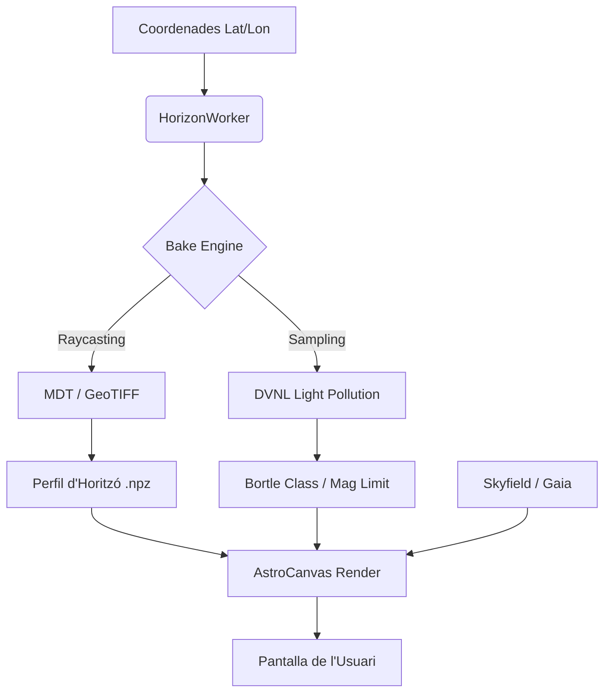

# 🌌 TerraLab: Anàlisi Topogràfica i Astrofísica

[](https://www.python.org/downloads/)

**TerraLab** és un motor d'anàlisi i visualització avançada que uneix la **topografia terrestre** amb el **renderitzat astronòmic de precisió**. A diferència dels planetaris convencionals, TerraLab calcula l'**horitzó real** basat en Models Digitals de Terreny (DEM) i estima la **visibilitat estel·lar dinàmica** mitjançant dades satel·litàries de contaminació lluminosa (DVNL).

---

## 🚀 Què fa TerraLab?

TerraLab no només dibuixa estrelles; calcula **què pots veure realment** des d'un punt exacte de la Terra, considerant:

1. **Muntanyes i Accidents Geogràfics**: Genera un perfil d'horitzó de 360° mitjançant raycasting sobre malles topogràfiques (ICGC/Copernicus).
2. **Contaminació Lluminosa Automàtica**: Escaneja dades satel·litàries *Day/Night Visible Lights* per assignar una classe de **Bortle** i un límit de magnitud estel·lar real.
3. **Mecànica Celesta de Alta Precisió**: Integra el catàleg **Gaia** (estrelles) i efemèrides **DE421** per posicionar els astres amb precisió sub-arcosegon.

---

## 🛠️ Com Funciona (Arquitectura i Matemàtiques)

### 1. El Motor d'Horitzó (Raycasting)

El `HorizonBaker` projecta milers de rajos des de la posició de l'observador cap a l'horitzó.

* **Decisió de Disseny**: Faig servir bandes de profunditat (*Depth Bands*) per evitar l'aliasing i permetre un gradient atmosfèric realista entre muntanyes properes i llunyanes.
* **Matemàtiques**: Cada raig aplica una correcció de **curvatura terrestre** ($h_{corr} = \frac{d^2}{2R_{earth}}$) per tal que les muntanyes a més de 100 km s'enfonsin correctament sota l'horitzó segons la distància.

### 2. El Model de Visibilitat (DVNL → SQM → Bortle)

He implementat un pipeline que converteix la radiancia satel·litària en qualitat de cel detectable per l'ull humà.

* **Convolució**: Faig servir un **Nucli de Convolució Gaussià** ($\sigma=1.5 km$) per fer la mitjana de la llum que arriba al **zenit**, simulant la resposta d'un sensor SQM (*Sky Quality Meter*).
* **La Fórmula**:
    $$SQM = 22.0 - 2.4 \cdot \log_{10}(Radiancia_{DVNL} + 0.001)$$
    Aquest model empíric permet que les zones industrials assoleixin un **Bortle 9**, mentre que els cims del Pirineu arribin a **Bortle 1** ($SQM \approx 21.9$).

### 3. Diagrama de Flux de Dades



---

## 📦 Instal·lació

1. **Clonar i instal·lar dependències**:

    ```bash
    pip install -r requirements.txt
    ```

2. **Dades Crítiques**:
    Assegura't de col·locar els fitxers binaris a `TerraLab/data/`:
    * `stars/gaia_stars.json` (Catàleg estel·lar)
    * `stars/de421.bsp` (Efemèrides JPL)
    * `light_pollution/C_DVNL 2022.tif` (Mapa de llums nocturnes)

3. **Executar**:

    ```bash
    python -m TerraLab
    ```

---

## 🏛️ Atribucions i Autoria

**Desenvolupador Principal:** Manel González Pérez.

**Dades i Fonts:**

* **Topografia**: ICGC (Institut Cartogràfic i Geològic de Catalunya) i Copernicus (ESA).
* **Estrelles**: Missió Gaia de l'ESA (European Space Agency).
* **Efemèrides**: NASA/JPL (Jet Propulsion Laboratory).
* **Contaminació Lluminosa**: Earth Observation Group (Payne Institute for Public Policy).
* **Clima**: *Copernicus Atmosphere Monitoring Service (CAMS) i MET Norway WeatherAPI.

**APIs externes utilitzades actualment:**

- **Copernicus Atmosphere Monitoring Service (CAMS)** via **Copernicus Climate Data Store (CDS / ECMWF)**.
  - Finalitat: mètriques atmosfèriques per al mode telescòpic (AOD i pressió superficial).
  - Accés: `cdsapi` amb credencials d'usuari.
  - Documentació: https://cds.climate.copernicus.eu/how-to-api
  - Llicència i termes: https://cds.climate.copernicus.eu/licences/licence-to-use-copernicus-products
  - Avís d'atribució utilitzat pel projecte:
    - `Generated using Copernicus Atmosphere Monitoring Service information [Year]`
  - Nota: l'ús està subjecte als termes del CDS i a les condicions del compte.

- **MET Norway WeatherAPI** (`api.met.no`).
  - Finalitat: integració de previsió meteorològica al mòdul de clima.
  - Documentació del producte: https://api.met.no/weatherapi/locationforecast/2.0/documentation
  - Termes del servei: https://docs.api.met.no/doc/TermsOfService.html
  - Base de llicència i atribució (CC BY 4.0): https://api.met.no/.License
  - Avís d'atribució utilitzat pel projecte:
    - `Weather data from MET Norway`
  - Nota: les peticions han d'incloure un `User-Agent` vàlid i complir els termes de MET Norway.

---

## ⚖️ Decisions Tècniques i Filosofia

* **Python + PyQt5**: Triat per la rapidesa d'iteració i la potència de `numpy` per al càlcul vectorial del cel.
* **Consciència de CRS**: El motor és conscient que els mapes satel·litàries no estan en graus, sinó en projeccions mètriques (**EPSG:8857**), assegurant una precisió total en les coordenades geogràfiques.
* **Focal de l'Ull Humà**: He calibrat la projecció perquè un zoom d'1.0 correspongui a la visió humana real, basant la focal equivalent en un sensor de 36mm (*Full Frame*).

---
*Creat amb ❤️ per a la comunitat astronòmica.*
