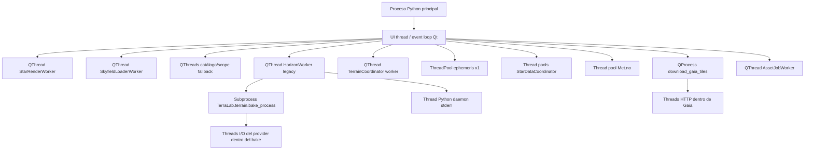
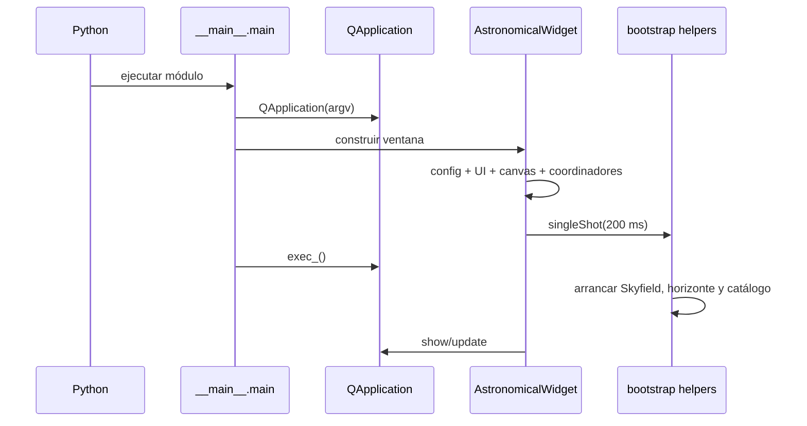
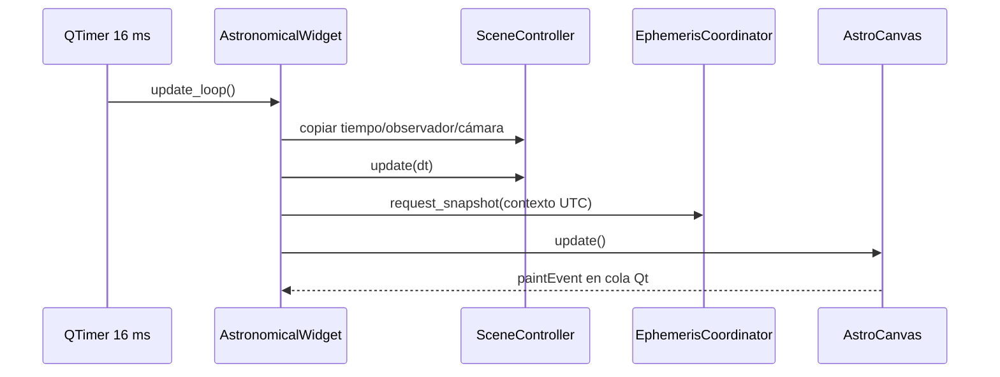
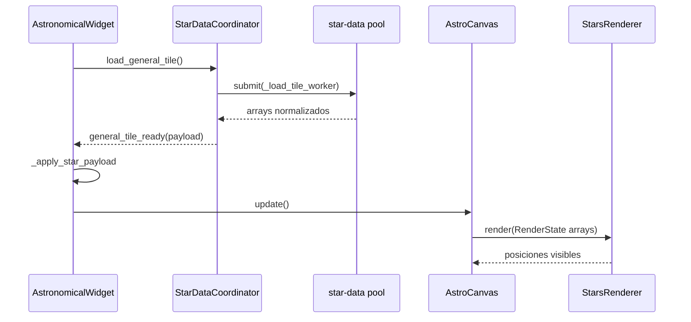
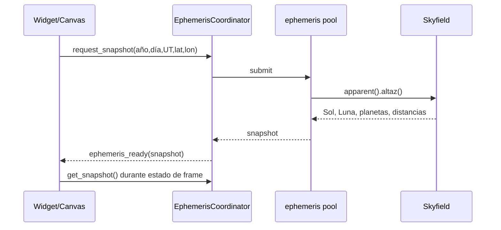
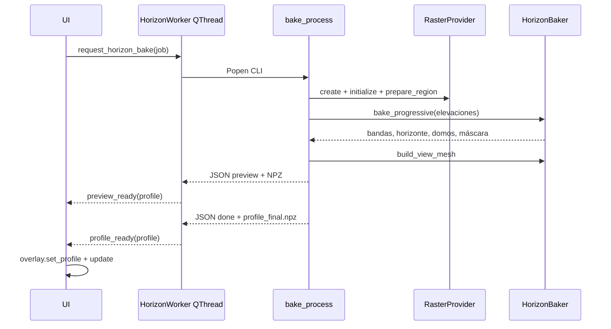
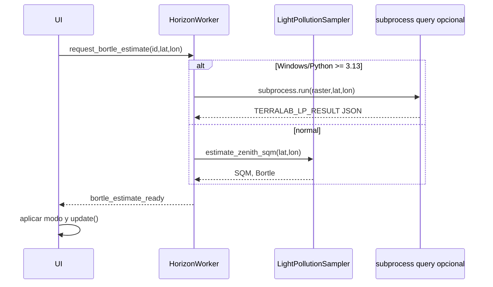
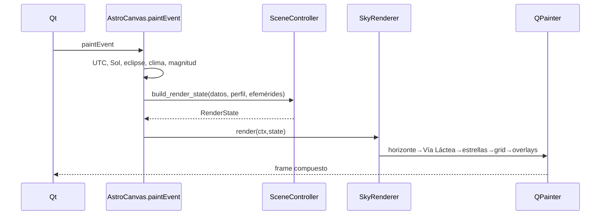
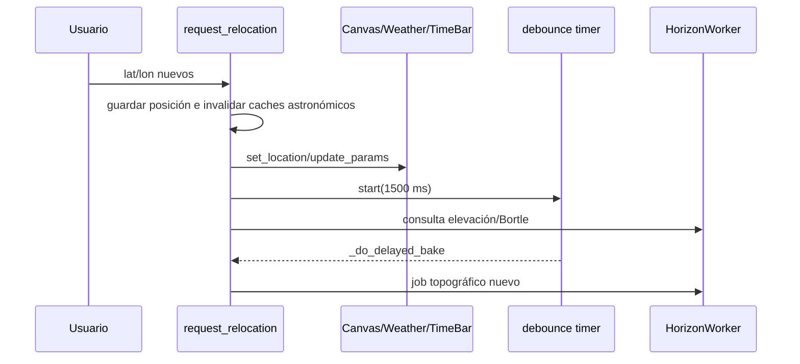
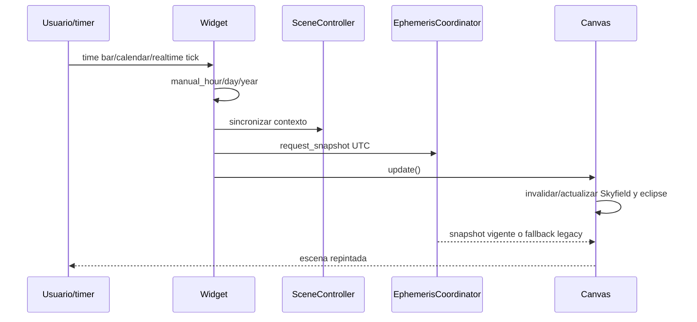

# Inventario de procesos y recorridos de ejecución de TerraLab

> Alcance comprobado: repositorio `ArcadiaLliure/TerraLab`, rama `refactor`. Este documento describe el funcionamiento actual; no prescribe cambios. Por “proceso” se entiende una unidad funcional identificada, pero cada ficha declara su tipo real.

## 1. Resumen general preliminar

TerraLab es una aplicación de escritorio PyQt5 que compone una vista astronómica para un observador, una fecha/hora y una cámara. El proceso principal crea `QApplication` y `AstronomicalWidget`. Durante la construcción del widget se leen la configuración y las rutas de datos, se crea el lienzo, se inicializan controles, estado meteorológico, cámara y renderizadores, y se programan tareas diferidas para no concentrar toda la carga en el constructor.

El bucle Qt permanece en el thread principal. Un timer de 16 ms sincroniza el estado de escena, pide efemérides y solicita repintado. `paintEvent` convierte la hora civil simulada a UTC, obtiene el contexto solar y de eclipse, construye el estado del frame y compone fondo, contaminación lumínica, clima, estrellas, Vía Láctea, horizonte, objetos astronómicos y overlays.

Los datos pesados se obtienen por varias vías: Gaia se carga mediante pools de threads o workers `QThread`; Skyfield y los catálogos legacy tienen workers propios; las efemérides usan un `ThreadPoolExecutor` de un hilo; y el horizonte se encarga a un `HorizonWorker` en `QThread`, que a su vez lanza `TerraLab.terrain.bake_process` como subprocess. El bake resuelve el proveedor raster, prepara el área, calcula bandas, horizonte, domos y malla, guarda NPZ y publica eventos JSONL. El worker lee esos archivos, emite señales y la UI instala el perfil en el overlay.

La escena no es un objeto inmutable global único: la UI conserva estado legacy, `SceneController` mantiene un estado equivalente para el pipeline nuevo y, en cada frame, `AstroCanvas._build_star_scene_state` reúne catálogos, cámara, horizonte, efemérides y flags en un `RenderState`.

```text
Inicio del proceso Python
→ QApplication y AstronomicalWidget
→ lectura de configuración y resolución de rutas de assets
→ creación de UI, canvas, cámara, estado y renderizadores
→ timers y bootstrap diferido
→ carga de Gaia/Skyfield y lanzamiento del cálculo topográfico
→ recepción de catálogos, efemérides y HorizonProfile
→ sincronización SceneController/estado legacy
→ paintEvent y construcción de RenderState
→ composición de cielo, terreno y overlays
→ pantalla
→ nuevas solicitudes por tiempo, ubicación, cámara, configuración o dataset
```

## 2. Tipos de ejecución encontrados

- **Proceso principal / UI thread:** `python -m TerraLab`; aloja el event loop Qt, widgets, callbacks, composición y pintura.
- **Subprocess:** bake topográfico, consulta aislada de contaminación lumínica, precarga scope y descarga/importación Gaia.
- **Proceso de `multiprocessing`:** importador Gaia y materialización ASC cuando esos flujos se invocan.
- **QThread:** workers de horizonte, Skyfield, catálogo, precarga/indexación scope, render legacy y jobs de assets.
- **Thread de Python:** drenaje de `stderr` de subprocesses.
- **Thread pool:** efemérides, datos estelares, proveedor ASC/GeoTIFF, clima remoto y tareas `QThreadPool` de inspección.
- **Timer:** frame/update, polling Gaia, debounce del horizonte, movimiento/selección, animación y callbacks diferidos.
- **Llamada síncrona/pipeline:** construcción del estado, transformación/proyección y composición del frame; se ejecutan en UI salvo indicación contraria.

## 3. Inventario general

| ID | Nombre funcional | Tipo real | Componente que lo inicia | Punto de entrada | Resultado | Destino del resultado |
| -- | ---------------- | --------- | ------------------------ | ---------------- | --------- | --------------------- |
| P01 | Arranque de la aplicación | Proceso principal | intérprete Python | `TerraLab/__main__.py::main` | ventana y event loop | usuario / callbacks Qt |
| P02 | Inicialización y bootstrap | Pipeline UI + `singleShot` | constructor del widget | `widget_init_helpers.py::astronomical_widget_init` | coordinadores, workers y estado inicial | canvas y UI |
| P03 | Bucle de escena | Timer Qt | `AstronomicalWidget` | `astronomical_widget.py::update_loop` | estado sincronizado y repaint pendiente | `AstroCanvas.paintEvent` |
| P04 | Efemérides | `ThreadPoolExecutor(1)` | P03 y canvas | `EphemerisCoordinator.request_snapshot` | snapshot Sol/Luna/planetas | señales y `RenderState` |
| P05 | Carga Gaia por teselas | pools de threads | `AstronomicalWidget` | `StarDataCoordinator.load_general_tile/load_deep_tile` | arrays de estrellas | widget y renderer |
| P06 | Consulta e índice estelar scope | pools de threads | modo scope | `request_cone_region/build_scope_index` | catálogo regional e índice | `StarsRenderer` / widget |
| P07 | Carga legacy Skyfield/catálogo/scope | QThreads | bootstrap o fallback | workers en `sky_legacy_components.py` | kernel, arrays e índices | widget legacy |
| P08 | Render estelar legacy | QThread | `AstroCanvas` | `StarRenderWorker.render/render_trails` | `QImage` y estrellas visibles | caché del canvas |
| P09 | Solicitud topográfica | Timer debounce + señal Qt | UI | `_begin_horizon_bake` | job dict | `HorizonWorker.request_bake` |
| P10 | Coordinación topográfica | QThread | bootstrap | `HorizonWorker.request_bake` | progreso, previews, perfil | UI y `TerrainCoordinator` |
| P11 | Bake topográfico | Subprocess Python | P10 | `terrain/bake_process.py::main` | NPZ `HorizonProfile` | P10 por JSONL + archivo |
| P12 | Precarga raster ASC/GeoTIFF | Thread pool interno | P11/provider | `RasterProvider.prepare_region` | bloques/teselas en caché | `HorizonBaker` |
| P13 | Contaminación lumínica automática | llamada en worker o subprocess síncrono | UI/HorizonWorker | `request_bortle_estimate` | SQM y Bortle | estado visual UI |
| P14 | Pipeline de render | llamada síncrona UI | Qt repaint | `canvas_runtime_helpers.py::canvas_paintEvent` | frame pintado | superficie del widget |
| P15 | NGC y cielo profundo | carga + pipeline síncrono | catálogo/UI/render | `ngc_catalog.py::load_ngc_catalog` | objetos proyectados/etiquetas | overlays/canvas |
| P16 | Vía Láctea | pipeline síncrono con caché | `SkyRenderer` | `MilkyWayOverlay.render` | textura transformada | painter |
| P17 | Importación/descarga de assets | QThread o QProcess | onboarding | `_AssetJobWorker.run` / `_start_gaia_tap_download` | datasets registrados/preparados | `AssetManager`, config y UI |
| P18 | Inspección y activación de datasets | `QRunnable`/thread pool + llamadas UI | diálogo de capas | `_InspectionTask.run` | metadatos y selección persistida | registro y siguiente bake |
| P19 | Descarga Gaia interna | QProcess + pool HTTP | onboarding | `tools/download_gaia_tiles.py` | teselas, manifest y estado JSON | coordinador estelar/polling |
| P20 | Meteorología remota | `ThreadPoolExecutor` | ciclo de pintura | `MetNoProvider` submit | forecast/cache | `WeatherSystem` y render |
| P21 | Timers auxiliares | timers Qt | UI/canvas | varios callbacks | invalidación, polling o animación | UI/canvas |

## 4. Fichas individuales

## P01 — Arranque de la aplicación

### Resumen funcional

Inicia el único proceso principal, habilita diagnóstico de fallos nativos, crea Qt y muestra la ventana.

### Tipo de ejecución

Proceso principal; UI thread Qt.

### Quién lo inicia

El intérprete al ejecutar `python -m TerraLab`.

### Condición de inicio

Inicio de la aplicación.

### Punto de entrada

`TerraLab/__main__.py::main`

### Recorrido completo

1. `main`
2. `QApplication(sys.argv)`
3. `StandaloneAstronomicalWidget.__init__`
4. `AstronomicalWidget.__init__`
5. `widget.show`
6. `QApplication.exec_`

### Explicación funcional paso a paso

1. Activa timestamps y `faulthandler` hacia `terralab_crash.log`.
2. Crea el event loop y UI thread.
3. Construye la ventana y toda la aplicación embebida.
4. La muestra y cede el control a Qt.

### Datos de entrada

Argumentos de proceso, cwd, configuración persistida y filesystem runtime.

### Datos intermedios

`QApplication`, ventana, coordinadores y widgets.

### Datos de salida

Ventana visible; código de salida del event loop.

### Comunicación

Llamadas directas y eventos/señales Qt.

### Finalización

Al cerrar la aplicación; `sys.exit(app.exec_())` propaga el código.

### Cancelación y errores

El cierre dispara `closeEvent`; excepciones no capturadas llegan a Python y fallos nativos quedan en el log.

### Componentes implicados

`TerraLab/__main__.py`; `StandaloneAstronomicalWidget`; `TerraLab/ui/astronomical_widget.py::AstronomicalWidget`.

## P02 — Inicialización y bootstrap

### Resumen funcional

Carga configuración, crea UI/canvas/estado y difiere trabajos pesados hasta que el event loop está activo.

### Tipo de ejecución

Pipeline dentro del proceso principal y callbacks `QTimer.singleShot`.

### Quién lo inicia

Constructores `AstronomicalWidget` legacy y fachada nueva.

### Condición de inicio

Construcción de la ventana.

### Punto de entrada

`TerraLab/ui/widget_init_helpers.py::astronomical_widget_init`

### Recorrido completo

1. `astronomical_widget_init`
2. `AssetManager.__init__` / `get_config_value`
3. `CustomWidgetBase.__init__` → `setup_content`
4. `astro_canvas_init`
5. timers de 16 ms, 5 s y debounce
6. `widget_start_async_bootstrap`
7. fachada: `SceneController`, `StarDataCoordinator`, `TerrainCoordinator`, `EphemerisCoordinator`

### Explicación funcional paso a paso

1. Resuelve layout de datos y preferencias de observador, catálogo, scope, Vía Láctea, clima y contaminación.
2. Crea controles y `AstroCanvas` con cámara, renderizadores, overlays y caches.
3. Arranca timers de frame/polling.
4. A los 200 ms inicia workers Skyfield/horizonte y catálogo si no se difiere.
5. La subclase nueva añade coordinadores y conecta sus señales.

### Datos de entrada

Config, rutas de `AssetManager`, fecha local, flags de rendimiento y assets existentes.

### Datos intermedios

Estado UI legacy, `SceneController`, canvas, pools y QThreads.

### Datos de salida

Aplicación operativa y tareas iniciales programadas.

### Comunicación

Llamadas directas, señales Qt y `singleShot`.

### Finalización

Termina el constructor; los recursos creados viven hasta `closeEvent`.

### Cancelación y errores

La mayoría de subsistemas hacen fallback o registran errores; el cierre detiene coordinadores. Los `singleShot` no tienen cancelación individual.

### Componentes implicados

`widget_init_helpers.py`; `widget_bootstrap_helpers.py`; `sky_widget_impl.py`; `astronomical_widget.py`; `AssetManager`; `AstroCanvas`.

## P03 — Bucle de actualización de escena

### Resumen funcional

Mantiene tiempo/posición/cámara coherentes, solicita datos dependientes y provoca frames.

### Tipo de ejecución

Timer Qt en UI thread (`16 ms`) y pipeline síncrono.

### Quién lo inicia

`astronomical_widget_init` conecta `self.timer.timeout`.

### Condición de inicio

Cada tick mientras no esté pausado.

### Punto de entrada

`TerraLab/ui/astronomical_widget.py::AstronomicalWidget.update_loop`

### Recorrido completo

1. `update_loop` de fachada
2. sincronización hacia `SceneController`
3. `SceneController.update`
4. `EphemerisCoordinator.request_snapshot`
5. selección de teselas scope cuando procede
6. `widget_runtime_helpers.widget_update_loop`
7. `canvas.update`

### Explicación funcional paso a paso

1. Copia fecha, hora, observador, cámara y controles al controlador.
2. Avanza el tiempo manual/real.
3. Pide el snapshot astronómico más reciente y catálogo de la región scope.
4. Actualiza HUD, clima y seguimiento a cadencias reducidas.
5. `update()` invalida el canvas y Qt agrupa el repaint.

### Datos de entrada

Estado UI, intervalo del timer, reloj, scope y controles.

### Datos intermedios

Estado de escena sincronizado y solicitudes asíncronas.

### Datos de salida

Petición de repaint y cambios de estado.

### Comunicación

Llamadas directas, futures y cola de eventos Qt.

### Finalización

Cada tick termina tras `canvas.update`; el timer continúa.

### Cancelación y errores

`pause_updates` evita trabajo; `timer.stop`/cierre lo termina. Muchas ramas aíslan excepciones para mantener el bucle.

### Componentes implicados

`astronomical_widget.py`; `widget_runtime_helpers.py`; `scene_controller.py`; `QTimer`; `canvas.update`.

## P04 — Cálculo de efemérides

### Resumen funcional

Calcula posiciones aparentes de Sol, Luna y planetas para observador/UTC sin bloquear el render.

### Tipo de ejecución

Thread pool de un worker.

### Quién lo inicia

P03 y `AstroCanvas.update_skyfield_cache`.

### Condición de inicio

Cambio/tick de tiempo u observador; solicitudes repetidas se coalescen.

### Punto de entrada

`TerraLab/astro/ephemeris_coordinator.py::EphemerisCoordinator.request_snapshot`

### Recorrido completo

1. `configure_observer`
2. `request_snapshot`
3. `_submit_request`
4. `_compute_snapshot_worker`
5. `_compute_snapshot`
6. `ephemeris_ready.emit`
7. `get_snapshot` → `SceneController.build_render_state`

### Explicación funcional paso a paso

1. Forma clave año/día/segundo/posición y descarta duplicados rápidos.
2. Si hay cálculo en curso conserva solo la última petición.
3. Skyfield convierte UTC y `wgs84.latlon` en observaciones aparentes alt/az.
4. Calcula radios angulares, separación Sol-Luna y lista planetaria.
5. Publica snapshot; sin Skyfield usa un fallback solar simplificado.

### Datos de entrada

Año UTC, día UTC, hora UT, latitud, longitud, timescale y `de421.bsp`.

### Datos intermedios

`datetime`, tiempo Skyfield, observador y observaciones aparentes.

### Datos de salida

Diccionario con timestamp, Sol, Luna, planetas y `eclipse_factor`.

### Comunicación

Future, locks, señal Qt y lectura protegida del snapshot.

### Finalización

Al guardar/emitir; después se lanza la última petición pendiente.

### Cancelación y errores

`shutdown(cancel_futures=True)` cancela pendientes; el cálculo activo no tiene abort cooperativo. Los errores emiten `ephemeris_error`.

### Componentes implicados

`EphemerisCoordinator`; señales `ephemeris_ready`, `ephemeris_error`; Skyfield `load`, `wgs84`.

## P05 — Carga Gaia por teselas

### Resumen funcional

Carga el catálogo general y teselas profundas, normaliza/combina arrays y los entrega al widget.

### Tipo de ejecución

Pools de threads (`star-data`, `star-preload`).

### Quién lo inicia

`AstronomicalWidget._try_attach_star_data_coordinator` y solicitudes scope.

### Condición de inicio

Manifest disponible/cambiado, catálogo general terminado o región scope nueva.

### Punto de entrada

`TerraLab/data/star_data_coordinator.py::load_general_tile` / `load_deep_tile`

### Recorrido completo

1. `TileManifest.load`
2. `load_general_tile/load_deep_tile`
3. executor → `_load_tile_worker`
4. lectura NPZ/store y normalización
5. `_combine_tiles`
6. señales `general_tile_ready/deep_tile_ready/extension_ready`
7. `_apply_star_payload`

### Explicación funcional paso a paso

1. Resuelve archivos e impide cargas duplicadas.
2. Lee arrays RA, Dec, magnitud, color e ID fuera de UI.
3. Añade suplemento no-Gaia, ordena/combina y controla residencia.
4. Publica dataset activo y el widget reemplaza sus arrays de render.

### Datos de entrada

`tile_manifest.json`, NPZ/almacén Gaia, suplemento `no_gaia_stars.json`.

### Datos intermedios

Tiles normalizados, firmas, sets inflight y dataset combinado.

### Datos de salida

Payload de arrays NumPy y metadatos.

### Comunicación

Futures, locks y señales Qt.

### Finalización

Al emitir el payload y retirar el tile del conjunto inflight.

### Cancelación y errores

`shutdown` cancela futures pendientes; generaciones invalidan consultas. Errores emiten `error_occurred`.

### Componentes implicados

`StarDataCoordinator`; `TileManifest`; `star_catalog_store.py`; `_load_tile_worker`; señales de catálogo.

## P06 — Consulta e índice estelar scope

### Resumen funcional

Obtiene estrellas profundas de un cono y prepara la estructura espacial utilizada por scope.

### Tipo de ejecución

Dos thread pools de un worker (`star-query`, `scope-index`).

### Quién lo inicia

`AstronomicalWidget.update_loop` y lógica de activación scope.

### Condición de inicio

Centro/FOV scope nuevo o catálogo activo modificado.

### Punto de entrada

`StarDataCoordinator.request_cone_region` y `build_scope_index`

### Recorrido completo

1. alt/az scope → RA/Dec
2. `request_cone_region`
3. `_query_cone_worker` → `StarCatalogStore.query_cone`
4. combinación de batches
5. `extension_ready`
6. `build_scope_index` → `build_scope_spatial_index_payload`
7. `scope_index_ready`

### Explicación funcional paso a paso

Consulta fuera de memoria por cono, conserva la última generación, une base/suplemento y crea índices/offsets para prefiltrar el campo scope.

### Datos de entrada

RA/Dec central, radio, magnitud límite, catálogo mmap/HEALPix y arrays activos.

### Datos intermedios

Batches, token de generación, dataset regional e índice ordenado.

### Datos de salida

Payload regional e índice scope.

### Comunicación

Iterador, future, token cancelable y señales Qt.

### Finalización

Cuando el payload vigente se publica.

### Cancelación y errores

Una nueva generación invalida la anterior entre batches; `InterruptedError` se ignora. Otros errores se señalan.

### Componentes implicados

`StarDataCoordinator`; `GenerationController`; `StarCatalogStore`; `StarsRenderer`.

## P07 — Carga legacy Skyfield, catálogo y scope

### Resumen funcional

Proporciona caminos de compatibilidad cuando los coordinadores nuevos no cubren el caso o no hay manifest.

### Tipo de ejecución

Varios `QThread` con workers Qt.

### Quién lo inicia

`widget_start_async_bootstrap`, `_start_catalog_loader_async`, `widget_ensure_scope_catalog_loaded` y warmup fallback.

### Condición de inicio

Bootstrap, timeout de 15 s, falta de dataset completo o entrada a scope sin coordinador.

### Punto de entrada

`widget_bootstrap_helpers.py::widget_start_async_bootstrap`

### Recorrido completo

`SkyfieldLoaderWorker.load`; `CatalogLoaderWorker.load/load_scope_extension`; `ScopeFullPreloadWorker.run`; `ScopeIndexWarmWorker.run` → señales ready/error → callbacks del widget.

### Explicación funcional paso a paso

Carga kernel Skyfield, descubre catálogos en disco, construye arrays y, si se solicita, catálogo profundo e índice scope persistente.

### Datos de entrada

Directorios Gaia/stars, NPZ/NPY, magnitud máxima y caches scope.

### Datos intermedios

Arrays, índice, offsets y rutas de cache.

### Datos de salida

Señales `skyfield_ready`, `catalog_ready`, `scope_extension_ready`, `ready/error`.

### Comunicación

Señales Qt entre worker y UI.

### Finalización

Callbacks hacen `quit/deleteLater` o limpian referencias.

### Cancelación y errores

El cierre/cleanup pide `quit`; no todos los trabajos poseen cancelación cooperativa. Los workers emiten error o progreso.

### Componentes implicados

`widget_bootstrap_helpers.py`; `widget_misc_helpers.py`; `sky_legacy_components.py`; `scope_preload_worker.py`.

## P08 — Render estelar legacy en worker

### Resumen funcional

Worker creado con el canvas para producir imágenes cacheadas de estrellas/trazas; coexiste con el render síncrono nuevo.

### Tipo de ejecución

`QThread`.

### Quién lo inicia

`astro_canvas_init` arranca siempre el thread; señales `request_render_signal/request_trails_signal` activan trabajo si el camino legacy las emite.

### Condición de inicio

Construcción del canvas; trabajo bajo solicitudes legacy.

### Punto de entrada

`TerraLab/widgets/sky_legacy_components.py::StarRenderWorker.render`

### Recorrido completo

señal del canvas → worker → cálculo/proyección a `QImage` → `result_ready/trails_ready` → `_on_star_result/_on_trail_result` → `update`.

### Explicación funcional paso a paso

Recibe un snapshot de parámetros, rasteriza fuera de UI y devuelve una imagen lista para componer. El camino principal actual `AstroCanvas.render → SkyRenderer` pinta estrellas síncronamente y no depende de este resultado.

### Datos de entrada

Arrays estelares, cámara, hora, observador y opciones visuales.

### Datos intermedios

Posiciones visibles y `QImage`.

### Datos de salida

Imagen y lista de estrellas visibles.

### Comunicación

Señales Qt.

### Finalización

Al emitir resultado; el thread permanece vivo.

### Cancelación y errores

Flags `rendering_busy` evitan solape; no se observó abort cooperativo por frame. El cierre del canvas/thread depende del cleanup legacy.

### Componentes implicados

`widget_init_helpers.py::astro_canvas_init`; `StarRenderWorker`; señales de render.

## P09 — Construcción y envío de la solicitud topográfica

### Resumen funcional

Convierte estado UI en un job estable de horizonte y lo envía al worker.

### Tipo de ejecución

Timer debounce y señal Qt queued.

### Quién lo inicia

Bootstrap, cambio de ubicación, offset, capas o configuración de terreno.

### Condición de inicio

`singleShot(900)` inicial o expiración de `bake_debounce_timer` (1,5 s).

### Punto de entrada

`TerraLab/ui/sky_widget_impl.py::_begin_horizon_bake`

### Recorrido completo

1. `_do_delayed_bake`
2. `_build_horizon_bake_job`
3. `_begin_horizon_bake`
4. `request_horizon_bake.emit(job)`
5. `HorizonWorker.request_bake`

### Explicación funcional paso a paso

Captura lat/lon, offset, bandas, cámara/FOV y un `job_id`; marca la UI como preparando y cruza al QThread del worker.

### Datos de entrada

Observador, configuración DEM, representación y cámara.

### Datos intermedios

Diccionario job y `job_id` activo.

### Datos de salida

Señal con job.

### Comunicación

Timer y señal Qt.

### Finalización

Tras emitir; P10 continúa.

### Cancelación y errores

Reiniciar el debounce sustituye la espera anterior; P10 cancela el subprocess previo al lanzar uno nuevo.

### Componentes implicados

`sky_widget_impl.py`; `widget_runtime_helpers.py::request_relocation`; `request_horizon_bake`; `bake_debounce_timer`.

## P10 — HorizonWorker y coordinación topográfica

### Resumen funcional

Resuelve DEM ligero, controla un subprocess, interpreta progreso y carga previews/final.

### Tipo de ejecución

Worker QObject en `QThread`; crea además un thread Python daemon para `stderr`.

### Quién lo inicia

`widget_start_async_bootstrap` crea `horizon_thread` y conecta P09.

### Condición de inicio

Recepción de `request_horizon_bake`.

### Punto de entrada

`TerraLab/terrain/worker.py::HorizonWorker.request_bake`

### Recorrido completo

1. `_resolve_tiles_dir` / `initialize`
2. `_build_subprocess_command`
3. `abort_current_job`
4. `subprocess.Popen`
5. thread `_drain_stream_to_stderr`
6. lectura JSONL de stdout
7. `HorizonProfile.load`
8. `preview_ready/profile_ready`
9. callbacks UI y puente a `TerrainCoordinator`

### Explicación funcional paso a paso

Valida el job y fuente; crea directorio temporal; termina el job anterior; lanza P11; transforma eventos en estado UI; abre NPZ de preview/final; emite objetos Python; limpia pipes y temporales.

### Datos de entrada

Job P09, configuración, DEM y ejecutable Python.

### Datos intermedios

Proceso, paths temporales, eventos JSON, `HorizonProfile`.

### Datos de salida

Señales de progreso, preview, perfil o error.

### Comunicación

Argumentos CLI, stdout JSONL, stderr drenado, archivos NPZ y señales Qt.

### Finalización

Al terminar el subprocess, cargar final y limpiar el temporal.

### Cancelación y errores

`abort_current_job` hace `terminate`, espera 1,5 s y luego `kill`. Un nuevo bake cancela el anterior. Exit code/evento error emite `error_occurred`. El thread stderr es daemon y se une 0,2 s; el subprocess queda referenciado mientras está activo.

### Componentes implicados

`HorizonWorker`; `horizon_thread`; `_drain_stream_to_stderr`; señales `progress_state`, `preview_ready`, `profile_ready`, `error_occurred`; `TerrainCoordinator.ingest_*`.

## P11 — Bake topográfico en subprocess

### Resumen funcional

Ejecuta el cálculo pesado aislado y produce el perfil completo del terreno.

### Tipo de ejecución

Subprocess Python.

### Quién lo inicia

P10 mediante `subprocess.Popen`.

### Condición de inicio

Job topográfico validado.

### Punto de entrada

`TerraLab/terrain/bake_process.py::main`

### Recorrido completo

1. parseo CLI
2. `_create_provider` → `create_raster_provider`
3. `transform_coordinates`
4. `provider.prepare_region`
5. `LightPollutionSampler.prepare_region_from_terrain_xy`
6. `generate_bands`
7. `HorizonBaker.bake_progressive`
8. previews `_save_preview_snapshot`
9. `HorizonBaker.build_view_mesh`
10. normales/visibilidad de malla
11. `HorizonProfile.save`
12. evento `done`

### Explicación funcional paso a paso

Resuelve ASC/TXT/NPY o GeoTIFF; transforma el observador a EPSG:25831; prepara hasta 150 km; obtiene altura del suelo; recorre 720 azimuts de 0,5° priorizando la vista; calcula máximos angulares y bandas por distancia, radiancia y domos; guarda previews parciales; muestrea la malla polar, calcula normales y visibilidad; persiste todo atómicamente.

### Datos de entrada

CLI: job, lat/lon, DEM, offset, bandas, paths y cámara; raster de contaminación.

### Datos intermedios

Provider, coordenadas UTM, bandas, máscaras, arrays de ángulos/distancias/alturas, domos, malla y normales.

### Datos de salida

`profile_preview.npz`, `profile_final.npz` y eventos JSONL.

### Comunicación

stdout estructurado, stderr de diagnóstico y NPZ.

### Finalización

Evento `done`, cierre de samplers/providers y salida 0.

### Cancelación y errores

No recibe señal cooperativa: la cancelación externa termina el proceso. Emite evento `error`, relanza y sale no cero. Escritura atómica usa temporal y reintenta `PermissionError`.

### Componentes implicados

`bake_process.py`; `providers.py`; `engine.py::HorizonBaker/HorizonProfile`; `light_pollution_sampler.py`.

## P12 — Preparación raster y consulta de elevaciones

### Resumen funcional

Selecciona proveedor y deja disponibles las elevaciones requeridas por P11.

### Tipo de ejecución

Pipeline síncrono dentro de P11 con thread pools internos de I/O.

### Quién lo inicia

`bake_process._create_provider` y `provider.prepare_region`.

### Condición de inicio

Comienzo de cada bake.

### Punto de entrada

`TerraLab/terrain/providers.py::create_raster_provider`

### Recorrido completo

1. `resolve_primary_dem_tiff_path`
2. GeoTIFF → `TiffRasterWindowProvider.initialize`; o ASC → `AscRasterProvider.initialize`
3. ASC: `TileIndex` lee headers ASC/TXT/NPY → `TileCache` → `DemSampler`
4. `prepare_region`
5. `get_elevation/sample_elevation`

### Explicación funcional paso a paso

Si existe TIFF usa el provider out-of-core y abre datasets ordenados por resolución; calienta bloques cercanos y lee bloques GDAL bajo caché. Sin TIFF indexa teselas ESRI ASCII/TXT/NPY por bbox, materializa/carga las solapadas mediante pool y hace interpolación. Ambos presentan coordenadas internas EPSG:25831.

### Datos de entrada

Ruta de archivo/carpeta, headers, CRS, bloques raster, centro y radio.

### Datos intermedios

Metadatos, transformadores, índice de tiles y caches.

### Datos de salida

Elevaciones escalares/batch y máscaras válidas.

### Comunicación

Retornos directos; futures internos; caches en memoria/NPY.

### Finalización

Tras precarga; las consultas continúan hasta cerrar provider.

### Cancelación y errores

ASC consulta `abort_check` y cancela futures; P11 pasa `None`, por lo que la cancelación real es terminar el subprocess. Tiles erróneos se registran y continúan; ausencia total falla.

### Componentes implicados

`providers.py::AscRasterProvider/GeoTiffElevationProvider`; `engine.py::TileIndex/TileCache/DemSampler`; `RASTERIO_LOCK`.

## P13 — Contaminación lumínica automática y modos visuales

### Resumen funcional

Muestrea el raster DVNL para estimar Bortle/SQM y aplica el modo automático, Bortle o Magnitud a cielo, estrellas, Vía Láctea y domos.

### Tipo de ejecución

Llamada en Horizon QThread; en Windows/Python ≥3.13, subprocess síncrono de consulta; aplicación gráfica síncrona.

### Quién lo inicia

Bootstrap, cambio de ubicación o activación del modo automático.

### Condición de inicio

`request_horizon_bortle` o `recalculate_automatic_light_pollution`.

### Punto de entrada

`HorizonWorker.request_bortle_estimate`

### Recorrido completo

1. `_build_light_sampler`
2. `LightPollutionSampler.estimate_zenith_sqm`; opcional `_estimate_light_pollution_isolated`
3. `bortle_estimate_ready`
4. `on_horizon_bortle_estimate`
5. `resolve_bortle_class` / `VisualMagnitudeEngine.compute`
6. background, estrellas, `MilkyWayOverlay` y `draw_light_domes`

### Explicación funcional paso a paso

Localiza DVNL, transforma lat/lon a pixel, obtiene radiancia y la calibra a SQM/Bortle. La UI valida que respuesta/posición sigan vigentes. Los modos manuales evitan la estimación y resuelven directamente clase o límite de magnitud. Durante P11 el mismo raster se muestrea por azimut para domos.

### Datos de entrada

DVNL TIFF, posición, modo, slider y perfil topográfico.

### Datos intermedios

Radiancia, SQM, clase Bortle, límite visual y `light_domes`.

### Datos de salida

Estado Bortle/magnitud, colores/opacidades/límites y domos renderizados.

### Comunicación

Señal Qt; opcional CLI/stdout prefijado; campos de `RenderState`.

### Finalización

Al aplicar valor y pedir repaint.

### Cancelación y errores

Consulta aislada tiene timeout de 30 s; error usa Bortle 4/SQM 21. Respuestas obsoletas se invalidan por request/posición.

### Componentes implicados

`worker.py`; `light_pollution_query.py`; `light_pollution_sampler.py`; `light_pollution/*`; `scene_state.py`; renderers.

## P14 — Ciclo de composición y render

### Resumen funcional

Convierte el estado actual en píxeles en el UI thread.

### Tipo de ejecución

Pipeline síncrono en proceso principal.

### Quién lo inicia

Qt al procesar una invalidación `canvas.update()`.

### Condición de inicio

Timer, interacción, señal de resultados o cambio visual.

### Punto de entrada

`TerraLab/ui/canvas_runtime_helpers.py::canvas_paintEvent`

### Recorrido completo

1. fondo negro/stage guard
2. contexto UTC y tracking
3. Sol/eclipse y fondo atmosférico
4. domos y clima
5. trazas
6. modelo de magnitud
7. `_build_star_scene_state`
8. `SceneController.build_render_state`
9. `AstroCanvas.render`
10. `SkyRenderer.render`: horizonte → Vía Láctea → estrellas/scope → grid → overlays
11. objetos Skyfield/NGC, terreno/village/HUD del camino legacy restante

### Explicación funcional paso a paso

Calcula entorno del frame, deriva visibilidad fotométrica, reúne arrays y snapshots, transforma coordenadas ecuatoriales a horizontales, filtra magnitud/horizonte, proyecta por cámara y pinta capas en orden. `QPainter` entrega el buffer al widget.

### Datos de entrada

Estado UI, `RenderState`, catálogos, perfil, efemérides, texturas y clima.

### Datos intermedios

Alt/az, máscaras visibles, coordenadas de pantalla, sprites e imágenes cacheadas.

### Datos de salida

Frame y listas de objetos visibles para picking.

### Comunicación

Llamadas directas y `QPainter`.

### Finalización

Al retornar `paintEvent` y destruir/finalizar el painter.

### Cancelación y errores

No se cancela un frame en curso. Qt puede coalescer `update()`. Varias capas capturan errores y omiten su dibujo.

### Componentes implicados

`canvas_runtime_helpers.py`; `astro_canvas.py`; `scene_controller.py`; `sky_renderer.py`; `stars_renderer.py`; renderers de horizonte/grid/scope/overlays.

## P15 — NGC y cielo profundo

### Resumen funcional

Carga OpenNGC, crea objetos buscables y los proyecta/etiqueta cuando la capa está activa.

### Tipo de ejecución

Carga y pipeline síncronos (normalmente dentro de carga de catálogo/UI y render).

### Quién lo inicia

Carga de catálogo/búsqueda y toggle `chk_deep_space`.

### Condición de inicio

Inicialización del índice de búsqueda o render con cielo profundo activo.

### Punto de entrada

`TerraLab/astro/ngc_catalog.py::load_ngc_catalog`

### Recorrido completo

CSV → parseo RA/Dec/magnitud/tamaño/nombres → `NGCObject` → índice de búsqueda/objetos del canvas → conversión ecuatorial-horizontal → filtro/proyección → símbolos y etiquetas.

### Explicación funcional paso a paso

Normaliza formatos y alias del CSV, conserva propiedades físicas, calcula alt/az para la hora/observador, descarta objetos no visibles o fuera del campo y dibuja símbolo/label.

### Datos de entrada

`data/sky/openngc_catalog.csv`, fecha/hora, posición, cámara y flag.

### Datos intermedios

`NGCObject`, alias, alt/az y coordenadas de pantalla.

### Datos de salida

Objetos visibles, etiquetas y entradas de búsqueda.

### Comunicación

Retornos directos y estado del canvas.

### Finalización

Carga al terminar CSV; render al terminar el frame.

### Cancelación y errores

No tiene cancelación; filas inválidas se omiten/normalizan y ausencia del asset impide la capa.

### Componentes implicados

`ngc_catalog.py`; `search_engine.py`; `sky_legacy_components.py`; `overlays_renderer.py`.

## P16 — Vía Láctea

### Resumen funcional

Transforma una textura equirectangular galáctica al campo visible y modula su brillo.

### Tipo de ejecución

Pipeline síncrono en UI con caches internas.

### Quién lo inicia

`SkyRenderer.render`.

### Condición de inicio

Capa `milkyway` activa y textura disponible; se omite con Sol demasiado alto.

### Punto de entrada

`TerraLab/render/sky/milkyway_overlay.py::MilkyWayOverlay.render`

### Recorrido completo

config/textura → carga/caché → malla de pantalla → unproject de cámara → alt/az a ecuatorial/galáctica → sample de textura/dust → modulación por twilight, LP y scope → composición.

### Explicación funcional paso a paso

Para cada muestra visible recupera la dirección celeste, la transforma al frame configurado, lee texel, aplica flips/offset y atenúa por luz solar, Bortle/magnitud, exposición y polvo Planck.

### Datos de entrada

PNG, fecha/hora/observador, cámara, configuración, DVNL/Bortle y opcional NPZ Planck.

### Datos intermedios

Imagen/malla sampleada, coordenadas galácticas y alfa.

### Datos de salida

Pixmap/imagen mezclada en painter.

### Comunicación

Llamadas directas y caches en memoria.

### Finalización

Al componer la capa.

### Cancelación y errores

No se cancela; asset ausente o configuración deshabilitada produce retorno sin dibujo.

### Componentes implicados

`MilkyWayOverlay`; `SkyRenderer`; `SceneState.extras['milkyway_overlay']`; `util/milkyway_importer.py` para preparación offline.

## P17 — Descarga e importación de assets

### Resumen funcional

Descarga o copia datasets requeridos, los prepara y actualiza configuración/estado.

### Tipo de ejecución

Worker Qt en `QThread`; Gaia usa además `QProcess`.

### Quién lo inicia

`AssetOnboardingDialog` tras acción del usuario.

### Condición de inicio

Activar una capa sin asset o elegir descargar/importar.

### Punto de entrada

`TerraLab/ui/onboarding_dialogs.py::_AssetJobWorker.run`

### Recorrido completo

1. diálogo selecciona modo/archivos
2. crea `QThread` + `_AssetJobWorker`
3. `AssetManager.download_and_prepare` o `import_files`
4. copia/descarga y preparación específica
5. señales progress/completed/failed
6. diálogo acepta y UI valida/activa asset

### Explicación funcional paso a paso

Ejecuta I/O sin bloquear la ventana, emite porcentaje, coloca archivos en layout runtime, actualiza estado del asset y puede autoajustar observador desde DEM.

### Datos de entrada

Asset ID, URLs, archivos elegidos, opciones y layout.

### Datos intermedios

Temporales, sidecars raster y progreso.

### Datos de salida

Dataset preparado y estado/configuración.

### Comunicación

Callbacks de progreso y señales Qt.

### Finalización

Señal completed/failed; thread se cierra en callbacks.

### Cancelación y errores

El diálogo controla cierre; el worker genérico no expone token cooperativo. Excepciones emiten `failed`; Gaia tiene controles propios descritos en P19.

### Componentes implicados

`onboarding_dialogs.py`; `_AssetJobWorker`; `AssetManager`; señales progress/completed/failed.

## P18 — Registro, inspección, selección y activación de datasets

### Resumen funcional

Registra rutas, inspecciona metadatos fuera de UI y persiste qué fuente usa cada rol.

### Tipo de ejecución

`QRunnable` en `QThreadPool.globalInstance`; callbacks y persistencia síncronos en UI.

### Quién lo inicia

`DataLayersDialog` al añadir archivo/carpeta.

### Condición de inicio

Selección/importación o cambio de prioridad/activación.

### Punto de entrada

`TerraLab/ui/data_layers_dialog.py::_InspectionTask.run`

### Recorrido completo

`_register_path` → `DataSourceRegistry.register_path` → `_schedule_inspection` → `inspect_source` → `_inspection_finished` → registry update/save → selección → `DataLayerChanges` → UI reload/debounce bake.

### Explicación funcional paso a paso

Infiere formato/capa, asigna ID/fingerprint, examina CRS, extensión, resolución y salud, actualiza el registro JSON y publica qué dependencias cambiaron para que proveedores/catálogo/render se invaliden.

### Datos de entrada

Ruta, tipo de capa, registro y selección actual.

### Datos intermedios

`DataSource`, resultado de inspección y `DataLayerChanges`.

### Datos de salida

Registro/selección persistidos y evento de cambios.

### Comunicación

Thread pool, señales `finished`, callback durable y archivo JSON.

### Finalización

Al aplicar inspección y actualizar el diálogo.

### Cancelación y errores

No hay cancelación explícita del `QRunnable`; errores vuelven en resultado y marcan salud. El cambio posterior fuerza recarga/bake según capa.

### Componentes implicados

`data_layers_dialog.py`; `source_inspection.py`; `data_sources.py::DataSourceRegistry/LayerSelectionService`.

## P19 — Descarga Gaia en proceso externo

### Resumen funcional

Descarga el catálogo visible y teselas profundas, reanudable, mientras la aplicación puede empezar con `tile_all`.

### Tipo de ejecución

`QProcess` externo; internamente `ThreadPoolExecutor` para peticiones TAP.

### Quién lo inicia

`AssetOnboardingDialog`.

### Condición de inicio

Usuario solicita descarga Gaia o reanuda un estado pendiente.

### Punto de entrada

`TerraLab/tools/download_gaia_tiles.py::main` (lanzado por onboarding).

### Recorrido completo

QProcess → downloader → peticiones TAP paralelas → NPZ por tesela + `tile_manifest.json` + estado JSON → stdout progreso → diálogo/polling → P05 detecta manifest/tile general.

### Explicación funcional paso a paso

Construye tesela general, publica disponibilidad temprana, continúa teselas profundas, actualiza estado reanudable y manifest. El diálogo puede desprender el `QProcess` y conservarlo en `_GAIA_BACKGROUND_PROCESSES`.

### Datos de entrada

Endpoint TAP, límites, tamaño de tesela, concurrencia y directorio.

### Datos intermedios

Descargas, estados por tile, logs y temporales.

### Datos de salida

NPZ, manifest, JSON de estado y líneas de progreso.

### Comunicación

Argumentos QProcess, stdout, ficheros y polling por timers.

### Finalización

Exit normal tras todas las teselas; la UI puede cerrar antes al estar lista la general.

### Cancelación y errores

QProcess permite terminate/kill desde el diálogo; el estado permite reanudar. Si se desprende, continúa intencionadamente hasta finalizar y el objeto se limpia con `finished`.

### Componentes implicados

`onboarding_dialogs.py`; `download_gaia_tiles.py`; `gaia_downloader.py`; `_GAIA_BACKGROUND_PROCESSES`; P05.

## P20 — Meteorología remota

### Resumen funcional

Obtiene pronóstico Met.no fuera del UI thread y alimenta efectos atmosféricos.

### Tipo de ejecución

`ThreadPoolExecutor` y pipeline periódico.

### Quién lo inicia

`WeatherSystem.update_weather` desde P14.

### Condición de inicio

Clima activo, datos ausentes/caducados y fuera de backoff.

### Punto de entrada

`TerraLab/weather/metno_provider.py` (submit de `_fetch_metno_compact`).

### Recorrido completo

paint tick → `WeatherSystem.update_weather` → provider comprueba cache/backoff → future HTTP → respuesta/cache → consulta del slot UTC → nubes/atmósfera/thunder.

### Explicación funcional paso a paso

Evita bloquear el frame, obtiene serie temporal compacta, la cachea y aplica el slot UTC al modelo visual.

### Datos de entrada

Lat/lon, UTC, user-agent, cache y red.

### Datos intermedios

Future y forecast.

### Datos de salida

Estado meteorológico renderizable.

### Comunicación

Future y cache de disco/memoria.

### Finalización

Cuando future termina; el provider conserva el resultado.

### Cancelación y errores

Backoff impide reintentos continuos; errores preservan cache/fallback. El executor se cierra con el sistema meteorológico.

### Componentes implicados

`weather/system.py`; `weather/metno_provider.py`; `AstroCanvas.weather`.

## P21 — Timers auxiliares y operaciones periódicas

### Resumen funcional

Agrupa timers que no constituyen cálculos autónomos pero disparan recorridos relevantes.

### Tipo de ejecución

Timers Qt en UI thread.

### Quién lo inicia

Constructores de widget/canvas/dialogs.

### Condición de inicio

Intervalo, interacción o evento UI.

### Punto de entrada

`widget_init_helpers.py::astronomical_widget_init/astro_canvas_init`

### Recorrido completo

- `timer` 16 ms → P03.
- `_gaia_extension_watch_timer` 5 s y `_gaia_attach_timer` 1,5 s → detectar datasets.
- `bake_debounce_timer` 1,5 s → P09.
- `_scope_move_timer` 16 ms → mover cámara scope.
- `_selection_pulse_timer` 16 ms → repaint del marcador.
- `anim_timer` 16 ms mientras anima → `animate_view` → repaint.
- timers onboarding 900 ms → estado Gaia.
- timers one-shot → bootstrap, onboarding, bridge y UI diferida.

### Explicación funcional paso a paso

Cada timer encola un callback en el event loop; el callback modifica estado, inicia otro flujo o llama `update()`.

### Datos de entrada

Intervalo y estado asociado.

### Datos intermedios

Ninguno común.

### Datos de salida

Callbacks, solicitudes o invalidaciones.

### Comunicación

Señal `timeout`/evento Qt.

### Finalización

Single-shot al disparar; periódicos al `stop`, cierre o destrucción del parent.

### Cancelación y errores

Los timers con parent se destruyen con él; debounce se reinicia. Callbacks no ejecutados desaparecen al terminar el event loop.

### Componentes implicados

`widget_init_helpers.py`; `astronomical_widget.py`; `onboarding_dialogs.py`; `hint_overlay.py`; `scope_ui_manager.py`.

## 5. Mapa de lanzamiento

| Lanzador | Proceso lanzado | Mecanismo | Condición |
| -------- | --------------- | --------- | --------- |
| intérprete | P01 | entrada de módulo | ejecución de TerraLab |
| P01 | P02 | llamada constructor | creación de ventana |
| P02 | P03/P21 | `QTimer.start` | inicialización |
| P02 | P07/P10 | `QThread.start` | bootstrap diferido |
| fachada `AstronomicalWidget` | P04/P05 | construcción de coordinadores/pools | constructor/manifest |
| P03/canvas | P04 | `ThreadPoolExecutor.submit` | contexto temporal nuevo |
| widget/Scope | P05/P06 | `submit` | manifest o región nueva |
| P09 | P10 | señal Qt queued | bake solicitado |
| P10 | P11 | `subprocess.Popen` | job validado |
| P10 | lector stderr | `threading.Thread.start` | subprocess lanzado |
| P11 | P12 | llamada y `ThreadPoolExecutor.submit` | preparar raster |
| UI automático | P13 | señal Qt; opcional `subprocess.run` | ubicación/modo automático |
| `canvas.update`/Qt | P14 | repaint event | invalidación |
| `SkyRenderer` | P15/P16 | llamada directa | capa activa |
| onboarding | P17 | `QThread.start` | descarga/importación |
| diálogo de capas | P18 | `QThreadPool.start` | fuente registrada |
| onboarding Gaia | P19 | `QProcess.start` | descarga Gaia |
| P14/WeatherSystem | P20 | executor `submit` | cache caducada |

## 6. Árbol real de procesos y threads



`TerrainCoordinator` crea realmente otro `HorizonWorker/QThread`; el flujo UI normal no le envía el job: recibe por bridge los resultados del worker legacy.

## 7. Diagramas de recorrido

### Inicio de la aplicación



### Actualización de la escena astronómica



### Carga y render de estrellas



### Cálculo de efemérides



### Cálculo topográfico



### Carga de contaminación lumínica



### Ciclo de render



### Cambio de ubicación



### Cambio de fecha y hora



## 8. Recorrido topográfico detallado

El recorrido efectivo es:

```text
Solicitud UI
→ _build_horizon_bake_job / _begin_horizon_bake
→ señal request_horizon_bake
→ HorizonWorker legacy en horizon_thread
→ construcción del comando
→ subprocess TerraLab.terrain.bake_process
→ create_raster_provider
→ inicialización ASC/TXT/NPY o GeoTIFF
→ prepare_region
→ HorizonBaker.bake_progressive
→ perfil por bandas + domos + máscara
→ build_view_mesh + normales/visibilidad
→ HorizonProfile.save (NPZ)
→ JSONL stdout
→ HorizonWorker carga NPZ
→ preview_ready/profile_ready
→ UI instala HorizonOverlay.profile
→ bridge TerrainCoordinator.ingest_*
→ canvas.update
→ render Perfil o Rellevo según representación
```

`TerrainCoordinator` no es el lanzador real del bake de la UI en esta rama. Se construye con su propio worker/thread, pero el job normal se conecta al worker legacy creado por bootstrap. Después, `_try_connect_horizon_worker` conecta `profile_ready/preview_ready` del legacy a `TerrainCoordinator.ingest_profile_payload/ingest_preview_payload`, de modo que el coordinador conserva el último perfil para `SceneController`.

La representación **Perfil** consume bandas/ángulos del `HorizonProfile` mediante `HorizonOverlay`/`HorizonRenderer`. **Rellevo** consume `terrain_mesh`, cuyos arrays incluyen azimuts, distancias, altitudes/elevaciones, normales X/Y/Z, validez y visibilidad. La selección concreta se propaga desde el registro/configuración de capas al job/estado de escena.

## 9. Recorrido astronómico detallado

La fecha/hora del widget representa tiempo civil del observador. `AstroCanvas._get_current_utc_context` la convierte a UTC; esa tupla alimenta efemérides y transformaciones estelares. Para estrellas y NGC, RA/Dec se transforman a coordenadas horizontales con tiempo sideral/observador, se filtran por magnitud y campo, se proyectan con la cámara y se ocultan respecto al horizonte cuando el perfil está disponible. El modelo de magnitud combina Sol/twilight/eclipse, atmósfera, modo de contaminación y, en scope, apertura/exposición/ISO.

```text
fecha/hora civil + observador
→ contexto UTC y tiempo sideral
→ RA/Dec o efemérides aparentes
→ altitud/acimut
→ filtro de magnitud, capa y campo de cámara
→ prueba contra horizonte/perfil
→ proyección a pantalla
→ modulación atmosférica y lumínica
→ composición Qt
```

- **Común:** contexto UTC, observador, cámara/proyección, flags de capa, horizonte y `QPainter`.
- **Estrellas:** arrays Gaia/no-Gaia; transformación por lotes, límite fotométrico, color BP-RP/sprite, índice scope.
- **NGC:** objetos CSV con RA/Dec, magnitud/tamaño/tipo y etiquetas; pipeline principalmente legacy.
- **Planetas:** `EphemerisCoordinator` produce alt/az/distancia; overlays calculan apariencia/magnitud y proyectan.
- **Sol:** snapshot con alt/az/radio; gobierna fondo/twilight y se dibuja como disco/corona.
- **Luna:** snapshot con alt/az/radio/separación; overlays calculan iluminación, orientación y solapamiento.
- **Eclipses:** se derivan de posiciones, radios y separación física Sol-Luna; el factor se cachea y atenúa fondo/visibilidad. Si el snapshot async no corresponde al tiempo solicitado, el canvas usa el cálculo legacy para no dibujar geometría obsoleta.
- **Vía Láctea:** no es un catálogo de puntos: se reproyecta una textura galáctica y se modula por los mismos contexto temporal, cámara, contaminación y polvo.

## 10. Invalidación, reinicio y cierre

- **Tiempo:** nuevas claves causan solicitud de efemérides; duplicados rápidos se descartan y queda solo la última pendiente. El repaint reconstruye el estado.
- **Posición:** se invalidan caches Skyfield/eclipse, se reconfiguran clima/timebar, se consulta elevación/LP y se reinicia el debounce topográfico.
- **Cámara:** no recalcula necesariamente datos base; cambia proyección, tesela/cono scope y prioridad de azimuts del siguiente bake.
- **Dataset:** el registro publica `DataLayerChanges`; proveedores marcan reload y catálogo/manifest se vuelven a adjuntar. Un bake nuevo sustituye el anterior.
- **Horizonte:** nuevo job termina el subprocess anterior, elimina su temporal y emite solo eventos cuyo `job_id` coincide.
- **Estrellas:** generaciones cancelan consultas regionales obsoletas; shutdown cancela futures pendientes y cierra stores.
- **Cierre:** `AstronomicalWidget.closeEvent` detiene polling y coordinadores. `TerrainCoordinator.shutdown` aborta y espera 1,5 s su thread; `EphemerisCoordinator` cancela futures; `StarDataCoordinator` cierra pools/store. Los recursos legacy realizan además su cleanup propio.

## 11. Resumen final del recorrido completo

Al abrir TerraLab, el proceso principal crea Qt y la ventana. El constructor lee configuración y layout, prepara cámara, clima, overlays, controles, estado y renderizadores, arranca el timer de frames y programa el bootstrap. Después se cargan kernel/efemérides y catálogos, se observa la llegada incremental de Gaia y se lanza el primer horizonte. Quedan activos el event loop, timers, pools de efemérides/estrellas/clima, varios QThreads de compatibilidad y, solo mientras hay trabajo, subprocesses de bake o descarga.

La primera escena útil puede aparecer con cielo base antes de que estén todos los datos. Al llegar el catálogo se instalan arrays; previews topográficas sustituyen progresivamente el horizonte; el perfil final aporta también malla y domos. Cada repaint convierte tiempo/observador en contexto celeste, reúne snapshot, catálogo y terreno, filtra/proyecta objetos y pinta las capas.

Si cambia el tiempo, se actualizan `SceneController`, efemérides, eclipse y proyección. Si cambia la posición, además se invalidan caches dependientes del observador, se reconfigura clima y se vuelve a calcular topografía/contaminación. Si cambia un dataset, el registro y manifest provocan recarga o nuevo bake. En todos los casos los resultados llegan por retorno directo, future, señal Qt o JSONL+NPZ; finalmente `canvas.update()` hace que Qt invoque `paintEvent` y el frame llegue a pantalla.

## 12. Límites de determinación

- Se documentan los caminos ejecutables y conectados desde la aplicación. Las herramientas CLI y tests no se consideran procesos permanentes de la GUI; `asc_cache_builder` y `gaia_importer` se citan cuando son alcanzables desde preparación/importación.
- El orden completo de funciones legacy dentro de algunas capas (NGC, satélites, village y objetos Skyfield) está repartido entre `sky_legacy_components.py` y renderers; se ha documentado el contrato funcional y los puntos de entrada comprobados, sin atribuirles threads separados.
- `StarRenderWorker` se crea y su QThread se inicia, pero el render principal de la rama pasa por `AstroCanvas.render/SkyRenderer` de forma síncrona. Su trabajo efectivo depende de que algún camino legacy emita sus señales.
- `TerrainCoordinator.request_bake` existe, pero no es el recorrido conectado de la solicitud normal de UI; no se presenta como tal.
