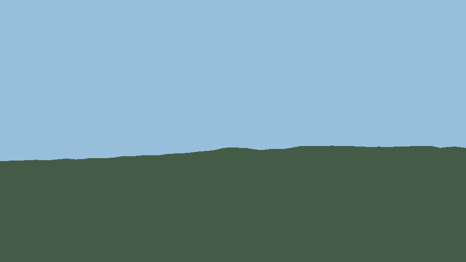
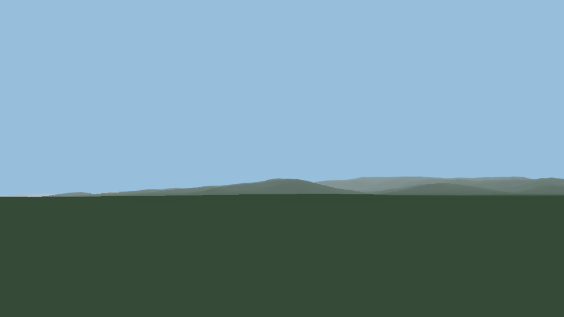

# Entrega: mejora del renderizado 2.5D del relieve

Fecha de medición: 2026-07-22. Rama: `refactor`.

El análisis previo completo del recorrido DEM → rayos → malla → color →
QPainter está en [terrain_render_pipeline_analysis.md](terrain_render_pipeline_analysis.md).
Este documento describe la implementación final, su configuración, las pruebas y
las mediciones reproducibles.

## 1. Resumen funcional

Se mantiene la arquitectura Python/PyQt5/QPainter, los workers existentes y el
formato `HorizonProfile`. No se ha introducido OpenGL ni un motor 3D.

Se han añadido:

- normales cartesianas ENU compartidas por vértice, con diferencias centrales y
  diferencias hacia delante/atrás en bordes;
- iluminación Lambert configurable por azimut y elevación solar;
- composición cromática por vértice que conserva el color de la cobertura del
  suelo y aplica después iluminación y atmósfera;
- perspectiva atmosférica exponencial, desaturación, reducción de contraste y
  ganancia de brillo escalables con el radio visible;
- rasterización localizada de los triángulos en un `QImage`, z-buffer e
  interpolación baricéntrica de RGBA;
- modos `flat`, `vertex` e `interpolated`, conservando la ruta QPainter anterior
  como fallback;
- muestreo radial en dos fases: paso creciente y refinamiento por error de
  elevación, error proyectado, cambio de pendiente, validez y posible transición
  de visibilidad;
- perfiles científicos de longitud variable por rayo y una malla visual con
  anillos LOD compartidos, que evita agujeros sin copiar la densidad máxima de un
  rayo a todos los demás;
- cobertura subpíxel localizada en la frontera geométrica cielo-terreno, antes de
  etiquetas y overlays;
- instrumentación optativa de muestreo, malla, normales, colores, rasterización,
  antialiasing y total;
- corrección del azimut geodésico al muestrear un DEM en EPSG:25831 mediante la
  convergencia del meridiano.

## 2. Pipeline nuevo

1. `HorizonBaker` transforma el observador al CRS del DEM y calcula la
   convergencia local de meridiano.
2. Se generan distancias base, uniformes o crecientes según configuración.
3. En modo adaptativo se consultan los puntos medios de los intervalos activos.
   Sólo se subdividen los que exceden alguna tolerancia; un intervalo aceptado no
   vuelve a consultarse.
4. Cada rayo conserva su propio vector de distancias, elevaciones y validez para
   producir los perfiles de horizonte.
5. `build_view_mesh` crea la malla polar visual sobre anillos LOD compartidos.
   Esta separación mantiene conectividad compatible entre azimuts sin densificar
   todos los rayos con el peor caso.
6. La elevación DEM se convierte a elevación aparente con curvatura/refracción y
   se calculan normales en coordenadas cartesianas locales este-norte-arriba.
7. En la GUI se prepara un activo inmutable con posición angular, distancia,
   elevación, validez, visibilidad y normal de cada vértice.
8. Se calcula una única intensidad Lambert por vértice compartido.
9. Se obtiene el RGBA base, se aplica iluminación y luego atmósfera por distancia.
10. Se proyectan los vértices para la cámara actual. Se descartan únicamente
    celdas que la máscara de visibilidad del raycast demuestra completamente
    ocultas, conservando una celda de transición alrededor de cada vértice visible.
11. En modo `interpolated`, un rasterizador software compilable con Numba produce
    id de triángulo, profundidad y coordenadas baricéntricas; NumPy interpola RGBA
    por bloques sobre los píxeles cubiertos.
12. La envolvente superior se calcula directamente desde los triángulos
    proyectados. Sólo su franja configurada recibe cobertura subpíxel.
13. QPainter compone el `QImage` de terreno y, después, los nombres, marcadores y
    demás overlays.

No hay objetos Qt en los argumentos enviados al subproceso. La configuración se
serializa como JSON y las matrices continúan almacenándose como NumPy.

## 3. Datos por vértice

La representación preparada por `_TerrainRenderAsset` contiene:

- azimut y distancia real al observador;
- elevación DEM y elevación aparente proyectable;
- validez y visibilidad/oclusión;
- normal local `(east, north, up)`;
- posición proyectada 2D, calculada y cacheada por vista;
- intensidad, color base y RGBA final, calculados en buffers compartidos por la
  malla.

Los índices `(fila_distancia, columna_azimut)` son la identidad del vértice. Los
dos triángulos incidentes consultan exactamente el mismo elemento de color y
normal, evitando diferencias por orden de triangulación.

## 4. Elevación aparente y prueba Morell → Puig d'en Cama

La función compartida por raycast, malla y prueba es:

```text
angle = atan2(h_target - h_eye - distance² / (2 * R_effective), distance)
```

La referencia independiente usa distancia y azimut geodésicos WGS84. El
renderizador usa distancia proyectada EPSG:25831 y convierte norte de cuadrícula
a norte verdadero con la convergencia local. Resultado del DEM configurado:

| Magnitud | Referencia | Renderizador | Desviación |
|---|---:|---:|---:|
| Elevación DEM del observador | 102,5186 m | 102,5186 m | < 0,0001 m |
| Elevación de referencia de Puig d'en Cama / DEM | 717,000 m | 694,7252 m | -22,2748 m |
| Distancia | 9.586,995 m | 9.586,004 m | -0,990 m |
| Azimut verdadero | 288,329401° | 288,329748° | +0,000347° |
| Elevación aparente | 3,487843° | 3,488210° | +0,000367° |

Otros valores relevantes: azimut de cuadrícula `289,513760°`, convergencia
`-1,184012°`, ojo `1,7 m` sobre el DEM y radio terrestre efectivo
`7.432.833,333 m`.

La referencia trigonométrica de `3,487843°` usa la misma muestra DEM de
`694,7252 m` que el renderizador, de modo que la desviación angular mide la
implementación geométrica y no mezcla además los `22,2748 m` de diferencia con
la cota de referencia de `717 m`.

El test solicitado se llama exactamente
`tests/test_morell_puig_den_cama.py`. Para mostrar todas las magnitudes y
desviaciones en el log:

```powershell
python -m pytest -q tests/test_morell_puig_den_cama.py --log-cli-level=INFO
```

## 5. Configuración añadida

Las claves son de primer nivel en las preferencias existentes. Los valores de
esta tabla son los defaults validados.

| Clave | Default | Función |
|---|---:|---|
| `terrain_lighting_enabled` | `true` | Activa normales + Lambert. |
| `terrain_light_azimuth_deg` | `315.0` | Azimut verdadero de la luz. |
| `terrain_light_elevation_deg` | `35.0` | Elevación de la luz. |
| `terrain_ambient_strength` | `0.55` | Componente ambiental. |
| `terrain_diffuse_strength` | `0.55` | Peso del producto normal-luz. |
| `terrain_min_brightness` | `0.45` | Límite inferior de intensidad. |
| `terrain_max_brightness` | `1.15` | Límite superior de intensidad. |
| `terrain_shading_mode` | `interpolated` | `flat`, `vertex` o `interpolated`. |
| `atmospheric_perspective_enabled` | `true` | Activa la atmósfera por distancia. |
| `atmosphere_start_distance_km` | `8.0` | Inicio nominal del efecto. |
| `atmosphere_end_distance_km` | `150.0` | Saturación nominal. |
| `atmosphere_density` | `2.2` | Densidad de la función exponencial. |
| `atmosphere_desaturation_strength` | `0.55` | Pérdida máxima de saturación. |
| `atmosphere_contrast_reduction` | `0.35` | Reducción máxima de contraste. |
| `atmosphere_brightness_gain` | `0.08` | Ganancia de brillo lejano. |
| `atmosphere_horizon_color` | `[184,207,223]` | RGB atmosférico. |
| `atmosphere_auto_scale` | `true` | Escala inicio/fin con el radio visible. |
| `adaptive_sampling_enabled` | `true` | Activa el muestreo en dos fases. |
| `sampling_near_step_m` | `25.0` | Paso inicial/mínimo. |
| `sampling_far_step_m` | `400.0` | Paso base máximo lejano. |
| `sampling_step_growth` | `1.045` | Crecimiento multiplicativo del paso. |
| `sampling_max_projected_error_px` | `0.75` | Tolerancia de error aparente. |
| `sampling_max_elevation_error_m` | `8.0` | Tolerancia vertical. |
| `sampling_max_slope_delta_deg` | `4.0` | Tolerancia de cambio de pendiente. |
| `sampling_max_subdivision_depth` | `6` | Profundidad máxima. |
| `sampling_max_samples_per_ray` | `4096` | Límite duro por rayo. |
| `horizon_antialiasing_enabled` | `true` | Activa cobertura de horizonte. |
| `horizon_antialiasing_mode` | `coverage` | `coverage`, `supersample` u `off`. |
| `horizon_supersampling_factor` | `4` | Cuantización de cobertura en ese modo. |
| `horizon_filter_width_px` | `1.25` | Anchura vertical máxima de la franja. |
| `terrain_performance_logging_enabled` | `false` | Emite eventos detallados si se activa. |

Ejemplo mínimo para volver a la compatibilidad anterior:

```json
{
  "terrain_lighting_enabled": false,
  "atmospheric_perspective_enabled": false,
  "terrain_shading_mode": "vertex",
  "adaptive_sampling_enabled": false,
  "horizon_antialiasing_enabled": false
}
```

Cada bloque puede activarse/desactivarse independientemente. Tras cambiar color,
iluminación o atmósfera, `HorizonOverlay.reload_render_settings()` invalida sólo
las cachés derivadas de color. Un cambio de muestreo requiere un nuevo bake.

## 6. Cachés e invalidación

| Cambio | Se reutiliza | Se recalcula |
|---|---|---|
| Sólo luz | DEM, rayos, malla, normales, proyección | intensidad, RGBA, imagen final |
| Sólo atmósfera | DEM, rayos, malla, normales, Lambert, baricéntricas | RGBA e imagen final |
| Tamaño de ventana | DEM, rayos, malla, normales, colores | proyección, z-buffer y AA |
| Azimut/FOV de cámara | perfil 360°, malla, normales y colores | selección/proyección de vista, z-buffer y AA |
| Posición del observador | caché de teselas DEM compatible | rayos, malla y todos los derivados |
| DEM | configuración general | todo el relieve |
| Capa de color | geometría, oclusión y normales | color base, RGBA e imagen final |

Los buffers de normales se producen durante la malla, no en el bucle de pintado.
La malla preparada, la iluminación, los colores, la geometría proyectada, las
baricéntricas y el `QImage` final tienen cachés separadas.

## 7. Medición antes/después

Comando reproducible:

```powershell
$env:QT_QPA_PLATFORM='offscreen'
python -m TerraLab.tools.benchmark_terrain_render
```

Escena exacta de ambas capturas:

- observador: `41.193151965759704, 1.2025659030876152`;
- elevación del observador: DEM `102,519 m`, offset `0 m`, ojo `1,7 m`;
- azimut `288,329401°`, elevación de cámara `0°`, FOV `60°`;
- resolución `960 × 540`, radio `50 km`, paso angular `1°`;
- misma paleta interna de terreno, sin capa superficial externa;
- mismo DEM configurado y mismo proceso de ejecución.

Los valores siguientes proceden de
[`metrics.json`](images/terrain_comparison/metrics.json). Son una ejecución local,
no un benchmark multiplataforma. Los tiempos de vista nueva y movimiento son la
mediana de tres proyecciones realmente desplazadas; las listas de ensayos quedan
también guardadas en el JSON.

| Métrica | Antes/fallback | Después | Diferencia |
|---|---:|---:|---:|
| Bake completo | 3,451 s | 12,320 s | +257,0 % |
| Muestras base de perfil | 131.760 | 60.480 | -54,1 % |
| Muestras finales conservadas | 131.760 | 110.056 | -16,5 % |
| Consultas totales incl. malla/refinamiento | 236.520 | 306.908 | +29,8 % |
| Refinamiento | 0 s | 6,634 s | nuevo coste en worker |
| Vértices de malla visual | 107.640 | 107.640 | sin cambio |
| Triángulos teóricos de malla | 213.964 | 213.964 | sin cambio |
| Primitivas de vista | 264 polígonos | 13.096 triángulos | rutas no equivalentes |
| Normales | 0,1089 s | 0,1876 s | variación de ejecución |
| Primer render/arranque | 1,508 s | 6,017 s | incluye carga/JIT |
| Vista nueva, JIT caliente | 1,506 s | 0,422 s | -72,0 %, 3,6× |
| Movimiento interactivo | 1,729 s | 0,238 s | -86,3 %, 7,3× |
| Vista idéntica cacheada | 0,898 ms | 3,420 ms | ambos < 4 ms |

El número teórico de triángulos no baja porque la malla visual usa anillos LOD
compartidos para garantizar conectividad. El modo nuevo sólo envía al rasterizador
los 13.096 triángulos que tocan la envolvente visible; los demás están ocultos.
El fallback pinta 264 polígonos de franjas y no rasteriza triángulos, por lo que
esas dos cifras de vista no deben interpretarse como la misma unidad de trabajo.

La reducción de muestras finales demuestra el objetivo adaptativo, pero la escena
de Prades es suficientemente accidentada para que comprobar puntos medios cueste
más consultas que el muestreo uniforme. Ese coste sucede en el worker de bake y
no en cada frame. Los límites de profundidad y muestras impiden crecimiento no
acotado.

## 8. Capturas comparativas

Antes, fallback uniforme sin iluminación/atmósfera/AA:



Después, normales + Lambert + atmósfera + interpolación + AA:



El benchmark dibuja sólo cielo y terreno para que etiquetas cambiantes no
contaminen la comparación. En la aplicación, el AA se ejecuta antes que las
etiquetas, que conservan su resolución original.

## 9. Pruebas

Las pruebas nuevas o ampliadas cubren:

- plano, pendiente, cresta y bordes sin NaN en normales;
- límites RGB, progresión y saturación de atmósfera;
- terreno plano/abrupto, cresta estrecha, cotas de error y máximo de muestras;
- valores compartidos, ausencia de costura de cobertura e independencia del
  orden de triangulación;
- horizonte diagonal, franja limitada, preservación de crestas subpíxel y
  ausencia de modificación fuera del borde;
- integración del modo uniforme y adaptativo con el baker;
- regresión geográfica Morell → Puig d'en Cama.

Resultado global final: `309 passed, 2 warnings in 73.59s`. La comprobación Ruff
`E9,F63,F7,F82` sobre todos los archivos modificados también pasa. El lint global
del repositorio conserva errores preexistentes en helpers que inyectan símbolos
dinámicamente mediante `globals()`; no se modificaron como parte de este trabajo.

## 10. Archivos modificados

| Archivo | Responsabilidad |
|---|---|
| `TerraLab/config.py` | Getters validados de render y muestreo. |
| `TerraLab/terrain/render_pipeline.py` | Configuración y etapas puras de luz, atmósfera y elevación aparente. |
| `TerraLab/terrain/sampling.py` | Base creciente y refinador adaptativo de referencia. |
| `TerraLab/terrain/crs.py` | Convergencia de meridiano. |
| `TerraLab/terrain/engine.py` | Raycast adaptativo, malla, normales, métricas y corrección de azimut. |
| `TerraLab/terrain/surface.py` | Muestreo superficial con el mismo norte verdadero. |
| `TerraLab/terrain/overlay.py` | Color por vértice, rasterizador, z-buffer, cachés y AA. |
| `TerraLab/terrain/bake_process.py` | Configuración serializable e instrumentación del subproceso. |
| `TerraLab/terrain/worker.py` | Paso de opciones al proceso de bake. |
| `TerraLab/ui/sky_widget_impl.py` | Parámetros de vista y configuración del job. |
| `TerraLab/tools/benchmark_terrain_render.py` | Capturas y medición reproducible. |
| `tests/test_terrain_render_pipeline.py` | Normales, luz y atmósfera. |
| `tests/test_terrain_surface_render.py` | Interpolación, costuras y horizonte. |
| `tests/test_adaptive_sampling.py` | Muestreo adaptativo e integración. |
| `tests/test_morell_puig_den_cama.py` | Regresión DEM/geodésica solicitada. |

## 11. Decisiones y limitaciones pendientes

- QPainter no interpola arbitrariamente tres valores de vértice. Se eligió la
  alternativa preferida: rasterización localizada a `QImage`; el fallback sigue
  usando QPainter.
- La primera llamada interpolada paga carga/compilación de Numba. La ruta NumPy
  funciona sin Numba, pero es más lenta; Python 3.13 + PyQt5 sigue siendo válido.
- El muestreo adaptativo reduce el perfil almacenado, no necesariamente las
  consultas de descubrimiento en relieve abrupto. Un refinador basado en una
  pirámide/min-max del DEM podría reducirlas en una fase futura.
- La malla visual mantiene anillos compartidos. Una triangulación plenamente
  irregular entre pares de rayos reduciría más triángulos, pero aumenta mucho el
  riesgo de T-junctions y no se introdujo sin una estructura topológica dedicada.
- El AA es cobertura vertical localizada, no MSAA completo. Está deliberadamente
  limitado a la franja del horizonte para no suavizar el interior ni overlays.
- Las cifras son de una escena y equipo concretos. Radios de 150–530 km deben
  medirse con el DEM de producción; la atmósfera sí escala automáticamente con el
  radio resuelto.
- La instrumentación detallada está apagada por defecto. Al activar
  `terrain_performance_logging_enabled`, genera eventos `terrain.mesh`,
  `terrain.raycast` y `terrain.render` sin añadir prints a la salida normal.

## 12. Commits lógicos

1. `3a29b97` — análisis del pipeline actual.
2. `e1c2d56` — normales, iluminación, atmósfera y elevación aparente.
3. `6c73f5a` — color compartido e interpolación por vértice.
4. `4864034` — muestreo adaptativo con fallback uniforme.
5. `a996877` — cobertura subpíxel del horizonte.
6. `ec3e119` — instrumentación, benchmark y optimización de trabajo oculto.
7. `4058b5b` — compatibilidad con perfiles sintéticos y sombreado heredado.
8. `eb793a4` — benchmark con proyección real y medianas de tres vistas.
